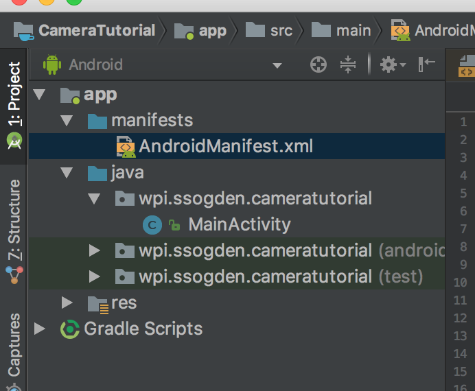
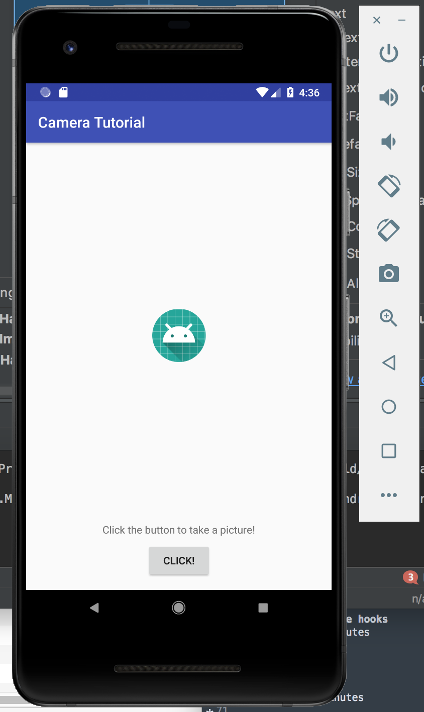
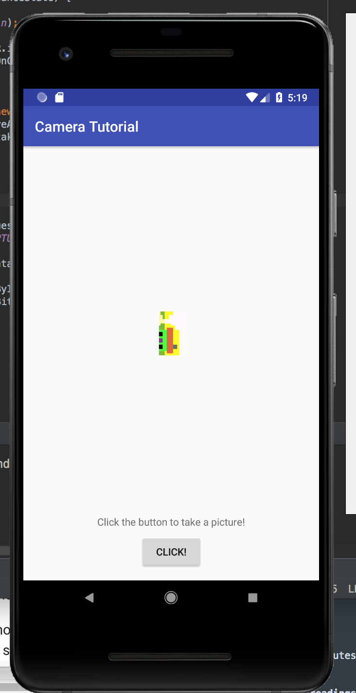
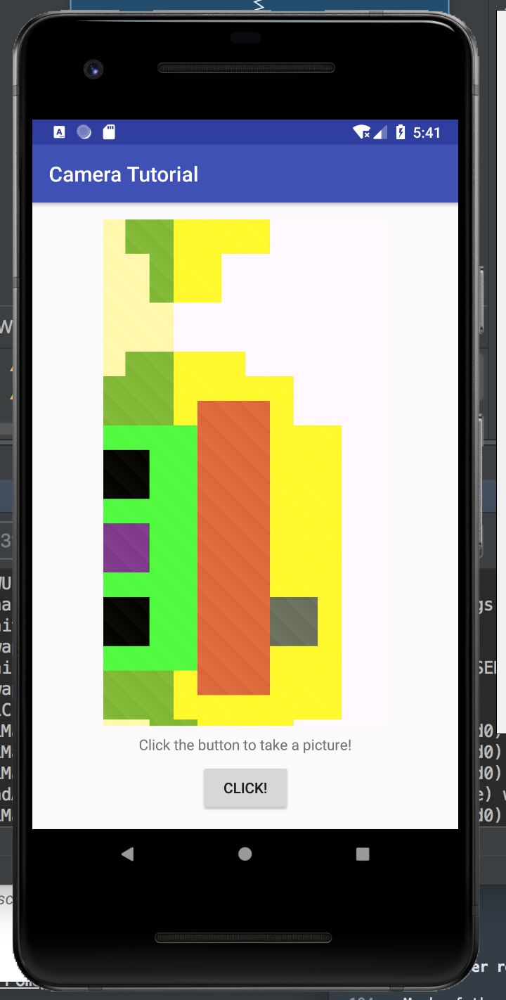
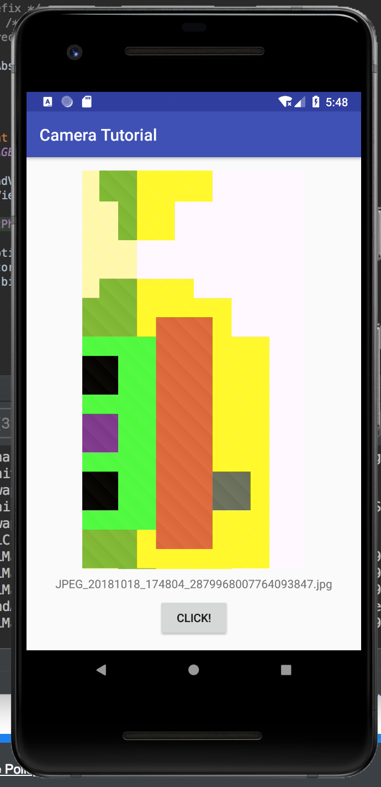

author: Sam Ogden
summary: CS4518 Android Sensor Tutorial
id: Camera
categories: Sensors, Camera
environment: java
status: draft


# CS4518 Android Application Sensors Tutorial
## Overview of Tutorial
Duration: ???

This tutorial will show you how to capture and save images for your Android app.  In this tutorial you will do the following:

- Capture input from a camera
- Save files to the Android filesystem
- Save the universe [to internal storage]!

Prerequisites:
- Android Studio Installed
- AVD with API 27 or higher
- Background knowledge on how to create UI in Android
    - If necessary, consult the UI tutorial provided [here](https://wpimobile18b.github.io/tutorials/UI/)

## Make a New Project
Duration: 5 minutes

Similar to the UI tutorial you'll want to set up a new project.  This time, like last time, make it a **blank** project.
The only difference is that now you should name it something along the lines of "Camera Tutorial" because I am still boring.
Again, pick an empty activity since it's more fun for us to build from scratch!


## Setting the manifest
Since we are using a camera in our application, we need to ensure that our app will not get installed on any device that does not have a camera.
To do this we need to add a few lines to the manifest file.

The manifest file is *conveniently* located in the manifests folder.  Double click on it to open it.


Positive
: Note that if you have switched from the default **Android** view to **Project** view, you can locate the manifest file in `app/src/main/AndroidManifest.xml`


Below the "application" entry add in another entry of the below:
```

    <uses-feature android:name="android.hardware.camera"
                  android:required="true" />
```
This alerts the Google Play app store that this app requires the use of the camera and not using it would cause major functional problems for the app. 

Positive
: By setting the above filter explicitly, Google Play app store will not display our app to any devices that do not have a camera. 

There is one more addition that we need to make to the manifests file.  Specifically, to save the photos we take to storage, we need to get permission to save the image to storage.  To do this add the `uses-permission` manifest entry:
```
    <uses-permission android:name="android.permission.WRITE_EXTERNAL_STORAGE" />
```

Now we should be good to go to start building our application!


## Building our Camera UI
Duration: 10 minutes

Because we want to keep our app simple we want our GUI to have three things.  First, we want a button to click in order to take a picture.  Second, we want a ImageView to display the picture that we've just taken.  Finally, let's add in a text box so we can display the name and path of the picture we've just taken.

Putting this together should be a breeze if you've gone through the first tutorial.  The only addition is a TextView (so it displays text but doesn't accept input text).  With a little effort you should end up with a GUI similar to the one below:


Negative
: Note that there are a number of warnings thrown in these steps.  Feel free to fix them as recommended, but it isn't strictly needed.


## Taking a picture!
Duration: 10 minutes

### Starting image capture
The most basic function of this app is to take a picture when you click the button.  To do this we'll be creating an intent object and starting the activity to take the picture.  There are three main components to this.
1. `Intent takePictureIntent = new Intent(MediaStore.ACTION_IMAGE_CAPTURE);`
    - This call creates the intent object with the specific intent being to capture an image
2. `List<ResolveInfo> activities = packageManager.queryIntentActivities(takePictureIntent, 0);`
    - This call checks if our implicit intent can be resolved. 
    - We should only start the activity if the returned list has more than one matches. 
    - By passing a flag of 0, we are ignoring all other defined constants for PackageManager.
3. `startActivityForResult(takePictureIntent, REQUEST_IMAGE_CAPTURE);`
    - This kicks of the activity related to the intent, in this case taking a picture.
    - The last part of this call, `REQUEST_IMAGE_CAPTURE` is an integer that is used to identify different intents.  This will be important in just a moment so make sure to define it somewhere it can be used across the app.

These three components should be done when you click your button so it kicks off the photo-taking activity.

Positive
: For step 2 above, we could also use the `takePictureIntent.resolveActivity(getPackageManager()) != null` to make sure the implicit intent can at least resolve to the default activity. 


### Displaying the image!

Okay, so we've now sent off to take a picture.  It works pretty well, right?  But nothing else happens...
So we need to do something when the child activity finishes. 

Catching an activity result in the parent activity is as easy as overriding the void function onActivityResult, as below.

```
@Override
protected void onActivityResult(int requestCode, int resultCode, Intent data) {
    ...
}
```

Within this function we need to do two things.

First, we need to verify that the requestCode matches the one we previously set (i.e. `REQUEST_IMAGE_CAPTURE`).  While you're at it you should also make sure that the resultCode is an acceptable value.

Second, we need to do something.  In our case we'll just be grabbing an automatically generated thumbnail from the "extras" of the Intent data.  This works for a simple and quick image capture.
We do this by first getting the extras bundle from the Intent bitmap data using `data.getExtras().get("data")`.  This data needs to be cast to a Bitmap type and then set using the same technique we used in the UI tutorial.

After you are done run your application to check out your new image capture!

Negative
: The first time you run this application on your AVD it will "setup" the camera.  This will interrupt the flow of your prorgram and you'll need to switch back to your app and click the button again.  



Wow, that looks cool!  But kinda lousy, too, because that thumbnail is terribly small.  How can we fix that?


## Saving the actual photo!
Duration: 10 minutes

The reason the image looks so lousy is because it is using a thumbnail quality photo.  We want the full photo.  To use this we need to make sure that we can save the original photo and display it instead.

Saving a photo requires first generating a temp file and passing its URI to the photo intent.

### Generating a file destination for the image

First, we need a directory to store our photos in.  We get this by calling `getExternalFilesDir(Environment.DIRECTORY_PICTURES)` which gives us a `File` object to use as a directory to save to.
The next step is to create a temporary file using `File.createTempFile(_filename_, _suffix_, _dir_)`.  This call returns a `File` object that we can use for our image.


### Modifying the Intent call

Next, we need to pass this new file to the intent call so it can save the image to our new file.
First we use the `FileProvider.getUriForFile(...)` function to generate a URI for our file.  (Hint: Don't forget the identifier of your application for the authority field!)

Next, we add this URI to our `takePictureIntent` using `takePictureIntent.putExtra(MediaStore.EXTRA_OUTPUT, photoURI)` to tell the Intent to store the output of extra to the URI.

*When doing this remember to ensure your file was created properly!*

### Defining a provider

If you hit Run on your app at the end of the last step and tried it out you'll see that you're suddenly getting an error when you try to get a URI for your new file.
This is because this file you created and passed to the Intent is actually private to your app (since API 24), and so cannot be shared with the camera picture.  Oh no!

To remedy this we need to define a **provider** in order to share files across application boundaries.  We need to do four things to do this.

#### Updating your gradle

Negative
: Heads up, you'll need an internet connection for modifying your gradle as it will download new files.

You need to add `compile 'com.android.support:support-v4:<version>'` to your app's build.gradle file where `<version>` is set to your target SDK level.  
The specific file you want, as there are two build.gradle files, is the one that is annotated with "Module: app" in *Android* view or `app/build.gradle` in *Project* view.
Your gradle will prompt you to sync, which can take a little while as it collects the appropriate files.

#### Updating your manifest
Next, you need to modify your manifest to indicate that your app will be sharing files.  To do this add the following snippet to your manifest under application.  Don't forget to update the authorities!
```
<provider
    android:name="android.support.v4.content.FileProvider"
    android:authorities="wpi.ssogden.cameratutorial.fileprovider"
    android:exported="false"
    android:grantUriPermissions="true">
    <meta-data
        android:name="android.support.FILE_PROVIDER_PATHS"
        android:resource="@xml/filepaths"></meta-data>
</provider>
```

After adding this you may notie that `@xml/filepaths` is highlighted in red as an error saying it can't resolve it.  We next take care of that.

#### Add filepaths
Finally, you need to add a resource file with the path `res/xml/filepaths.xml`.
You do this by right-clicking on your app and telling it to add in an XML resource file named "filepaths".
Replace the contents of this file with the following snippet, again paying attention to the identifier string.
```
<?xml version="1.0" encoding="utf-8"?>
<paths xmlns:android="http://schemas.android.com/apk/res/android">
    <external-path name="my_images" path="Android/data/wpi.ssogden.cameratutorial/files/Pictures" />
</paths>
```

#### Catching and displaying the photo  
So now you're all set up to save the photos as you take them.  There's one problem though: how do we know what the name of the file is in `onActivityResult(...)`?

There's two ways to do this.  First, is to read the URI and then have android tell us what the file associated with is.  This method is a bit complex.

Instead, we'll use the second, simpler, approach and just export the filename globally.  This is safe because we won't be called onActivityResult until after we have set the filename.  So add in a variable named `mCurrentPhotoPath` to hold this path.  We can find the path using `getAbsolutePath()` when we first generate the image file.

Finally we're ready to read this photo in after taking it!  Go back to your `onActivityResult(...)` function and change it to load the path that we've now stored and use it to set the image instead of the thumbnail from before.  Hint: Doing so requires using a BitmapFactory.



Wow that looks so much beter!

### But wait, didn't we say we'd change that text, too?
Well, that's simple.  You simply set it to the name of the filepath.  Shouldn't be any trouble, right?




## Summary
So that was a long one!  Taking and saving photos in Andorid can be a bit complex as there's a lot to control.  Luckily Android provides some easy ways for us to have the OS take care of a lot of the details for us.  The big take homes are:
- Intent can use default applications for common tasks
- Using `Intent` objects is an event-driven concept, where you start the intent and then catch the response in another function.
- A `FileProvider` is needed to pass files between applications
- Changing views is very similar between different kinds of views.


## Further readings

Much of the detail of how to submit intent to take pictures was taken from the official google tutorial at [https://developer.android.com/training/camera/photobasics](https://developer.android.com/training/camera/photobasics).

More details instructions on making your own camera application from scratch can be found at [https://developer.android.com/training/camera/cameradirect#java](https://developer.android.com/training/camera/cameradirect#java).

Adding file providers can be confusing.  I referenced [https://drivy.engineering/android-fileprovider/](https://drivy.engineering/android-fileprovider/) extensively in writing this.
